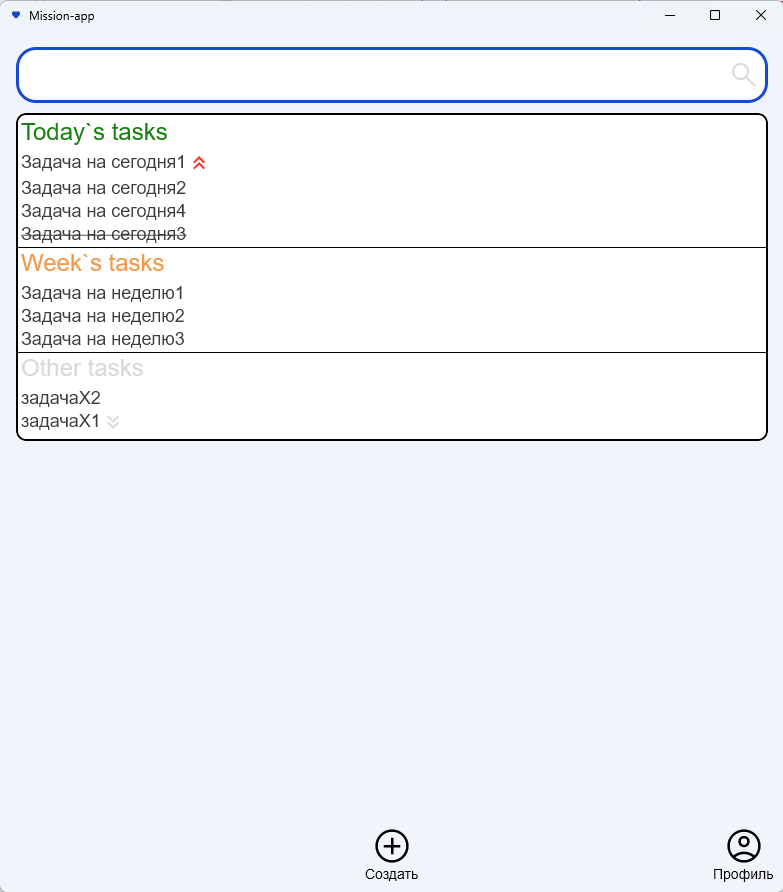

# Mission-app 
Приложение для организации проектной деятельности, таск менеджер `#MadeOwn`

> 
> 
> _Non-commercial KYamshanov`s project for self management_

## Technologies used

Используемые технологии:
1) kotlin multiplatform 
2) kotlin compose
3) decompose
4) koin
5) ktor

## Road map

1) architecture design [Done]
2) development own task manager [Done]
3) integration OAuth authorization by ~~authorization service~~ mission-id [in dev]
4) architecture project managment
5) architecture offline work

## Promotion

Главный экран:

Экран создания:

Экран редактирования:

## Requirements
на 28.10.2023 число необходимо использование backend запускаемый в локальном докере. Репозиторий: https://github.com/KYamshanov/Mission-backend  

## Текущий этап разработки: 
1) ~~разработка архитектуры kotlin multiplatform приложения. Поддержка android, desktop, js~~
2) ~~миграция функциональности разработанного приложения mission-android~~
3) ~~реализация функциональности таск менеджера~~
4) ~~поддержка Mission OAuth для android~~
5) поддержка проектов
6) стабилизация авторизации
7) работа в оффлайне

Приложение должно:
1) ~~портировать функциональность разработанного приложения mission-android (https://github.com/KYamshanov/mission-android) с поддержкой android/desktop;~~ LEGACY. see point 3;
2) реализовывать функциональность таск менеджера на основе главы "Практики экономии мыслетоплива" книги "Джедайские техники Как воспитать свою обезьяну, опустошить инбокс и сберечь мыслетопливо";
3) реализовывать функциональность управления проектами. Связывание задач с проектами и их менеджмент.
